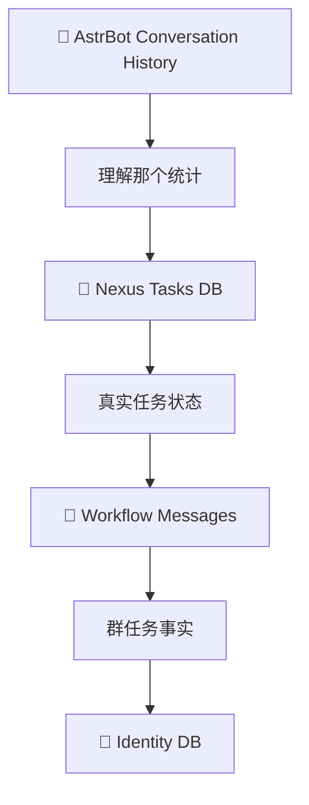

# 🌌 微光·群枢 / Lumielle Nexus

> 一个面向 AstrBot + QQ 的跨会话群事务编排插件。

[](metadata.yaml)
[](https://github.com/AstrBotDevs/AstrBot)
[](https://github.com/AstrBotDevs/AstrBot)
[](LICENSE)

微光·群枢（Lumielle Nexus）让私聊成为控制台，让群聊成为可调度的工作空间。它把提醒、DDL、信息收集、群消息事实、成员身份、投票和安全操作持久化到同一个轻量 SQLite 任务系统中。

| 项目 | 当前值 |
| --- | --- |
| Version | `0.10.0` |
| AstrBot | `>=4.25.5,<5` |
| Platform | `aiocqhttp` / OneBot v11（QQ，主要面向 NapCat） |
| License | MIT |

## 📊 当前状态

| 模块 | 状态 |
| --- | --- |
| Reminder / DDL / recurring / course | ✅ |
| Collection / checkpoint / XLSX | ✅ |
| Identity DB / member sets | ✅ |
| Archive / on-demand summary / weekly summary | ✅ |
| Relay | ✅ preview → confirm |
| Moderation | ✅ 默认关闭、单成员 |
| Native message Poll | ✅ |
| Real-world QQ / NapCat / Provider validation | 🧪 仍需实际环境验证 |

✅ 表示代码实现和自动测试完成；🧪 不代表已经完成真实 QQ、NapCat 或付费 LLM Provider E2E 验证。

## 🔗 兼容性

- AstrBot：`>=4.25.5,<5`。
- 平台：`aiocqhttp` / OneBot v11，主要面向 QQ + NapCat。
- AstrBot 4.25.5 和 4.28.0 的独立 loader smoke 均验证过插件导入与工具注册，共 37 个工具。

## ✨ 能做什么

### ⏰ 任务调度

- 单次 Reminder、DDL、提前提醒、周期提醒和课程提醒。
- 插件重载后从 SQLite 恢复未完成任务。

### 📋 Collection 信息收集

- 按字段收集群成员信息，重复提交自动更新。
- 可按成员集合定向收集，并在创建时固定目标快照。
- 标准字段消息立即确定性写入；自然语言填写由持久化 workflow capture 和增量 checkpoint 处理。
- checkpoint 催办、deadline finalize、missing default 和 XLSX 导出。

### 🧠 群消息事实与 AI

- 群消息 Archive 默认关闭，开启后才记录新的文本消息。
- 按关键词、时间范围检索，并可按需或按周总结。
- 群消息不会逐条调用 LLM：Collection 平时先持久化 capture，checkpoint 只处理 cursor 之后的新消息。
- 总结模型只负责整理，不会自动创建 DDL 或其他任务。

### 🗳️ 原生群消息投票

Poll 不依赖网页、公网端口、QQ OAuth 或浏览器 Cookie。创建后，Bot 在群里发布 Poll ID、选项和回复 key，成员直接回复即可：

```text
【群投票】
明天下午几点开会？
1. 14点（回复：14）
2. 15点（回复：15）
3. 16点（回复：16）

请在群内直接回复选项编号、标签或 reply key。
也可回复：投票 P-20260918-001 15
```

支持单选、多选、2–20 个选项、截止时间、是否允许改票、手动结束/取消和截止后自动公布结果。确定性解析永远优先；只有 Poll 明确候选且创建时保留了 Provider ID 时，才会最多调用一次受限语义判断。语义判断失败不会写入投票。

## 🔄 Collection 工作流

```mermaid
flowchart LR
    A[创建统计任务] --> B[群消息持久化 Capture]
    B --> C[19:00 Checkpoint]
    C --> D[@ 未形成有效结果成员]
    D --> E[继续 Capture]
    E --> F[20:00 Finalize]
    F --> G[默认值]
    G --> H[XLSX]
```

平时只做持久化 capture，checkpoint 批量分析新增消息，截止时收尾并导出；不在每条群消息到达时调用 LLM。

## 🚀 30 秒上手

```text
/nexus bind 班群 123456789
/nexus groups
```

随后在私聊中使用自然语言：

```text
明天下午三点在班群提醒所有人交实验报告。
在班群发一个投票：周末吃什么？火锅、烧烤、日料，明晚八点截止。
```

### Poll fallback commands

```text
/nexus poll list
/nexus poll show <P-ID>
/nexus poll close <P-ID>
/nexus poll cancel <P-ID>
/nexus poll result <P-ID>
/nexus poll create . | 标题 | 选项A | 选项B | 选项C
/nexus poll create . | 标题 | 周六=>sat | 周日=>sun
```

群成员投票可直接回复 `1`、完整选项标签或自定义 key；多选可回复 `1 3`、`1,3` 等。多个进行中的 Poll 建议使用 `投票 <P-ID> <选项>` 消除歧义。

## 📋 Collection 示例与成本模型

管理员可以在私聊中说：

```text
现在统计大家的返校情况，19点提醒还没回复的同学，20点截止，没回复的默认未返校，最后给我整理成表格。
```

成员可以提交 `我7号下午三点回来`，也可以使用 `返校时间：10月7日下午3点`。标准格式会立即确定性写入；自然语言会在 checkpoint 批量理解。

```text
17:00 ─────────── 19:00 ─────────── 20:00
      💾 Capture       🧠 Checkpoint      🧠 Finalize
      0 LLM            only delta         📊 XLSX
```

例如 19:00 已分析到 cursor `#120`，20:00 只处理 `#121+`。没有新增消息时 checkpoint 为 0 次 LLM 调用。

## 🪪 成员身份与集合

身份字段保存在 Nexus 自己的数据库中：

```text
QQ 123456789
       ↓
姓名：张三
学号：2026123456
```

成员集合按群隔离，可用于 Collection 目标快照和 Relay @成员集合。Collection 创建后集合变化不会改动既有目标快照。

## 🔄 跨会话同步



Conversation history 只用于辅助识别上下文；任务状态、群消息事实和身份数据的 source of truth 是 Nexus SQLite。不会把 API key、token 或 Provider credential 写入数据库。

## 🔐 权限矩阵

| 能力 | 私聊 Operator/Admin | QQ 群 owner/admin | 普通群成员 |
| --- | :---: | :---: | :---: |
| 创建当前群 Collection / Poll | ✅ | ✅ | ❌ |
| 查看当前群统计 / Poll | ✅ | ✅ | ❌ |
| 当前群 Reminder / DDL | ✅ | ✅ | ❌ |
| Identity 维护 | ✅ | ✅ 当前群 | ❌ |
| 跨群 Relay / Archive / Summary | ✅ | ❌ | ❌ |
| Bind Group | ✅ | ❌ | ❌ |
| Collection / Poll 回复 | — | — | ✅ |
| mute / unmute / kick | 独立 moderator 权限 | 不自动获得 | ❌ |

群内控制只能作用于当前绑定群；私聊和跨群控制需要 operator。QQ群 admin 不等于 Nexus moderator，`operator_ids` 不会自动升级为群管理权限。

## 📦 安装

### AstrBot WebUI

```text
AstrBot WebUI → 插件 → 右下角 + → URL 安装
```

仓库地址：

```text
https://github.com/Lumielle-BlueOMOcean/astrbot_plugin_lumielle_nexus
```

安装后找到“微光·群枢”，执行加载或重载。

### Git 安装到 `data/plugins`

```bash
cd AstrBot/data/plugins
git clone https://github.com/Lumielle-BlueOMOcean/astrbot_plugin_lumielle_nexus.git
cd astrbot_plugin_lumielle_nexus
git pull --ff-only origin main
```

升级时在已有目录执行 `git pull --ff-only origin main` 即可，不要删除插件数据。

### 依赖

在与 AstrBot 相同的 Python 环境中执行：

```bash
python -m pip install -r requirements.txt
```

运行依赖只有 `openpyxl`；AstrBot、aiocqhttp/OneBot 和 LLM Provider 由宿主环境提供。

## ⚙️ 初始配置

配置项以 `_conf_schema.json` 为准：

| 配置 | 默认值 | 说明 |
| --- | --- | --- |
| `operator_ids` | `[]` | 额外允许控制插件的 QQ 用户 ID |
| `timezone` | `Asia/Shanghai` | 时间解析时区 |
| `scheduler_interval_seconds` | `15` | scheduler 检查间隔，运行时限制 `5–60` 秒 |
| `max_retry_count` | `3` | 普通提醒发送失败后的最大重试次数 |
| `collection_ack` | `true` | 是否确认确定性群成员提交 |
| `archive_max_message_chars` | `4000` | 单条归档文本上限，运行时限制 `256–20000` |
| `archive_retention_days` | `90` | 归档保留天数；`0` 表示不自动清理 |
| `moderation_enabled` | `false` | 是否开启单成员群管理，默认完全关闭 |
| `moderator_ids` | `[]` | 独立群管理 QQ 用户 ID，不继承 `operator_ids` |

Poll 不需要额外监听端口或公网配置；它使用当前 QQ 群消息事件。

## 🗃️ 数据与隐私

运行数据写入 AstrBot plugin data directory，而不是插件仓库：

```text
data/plugin_data/astrbot_plugin_lumielle_nexus/
├── lumielle_nexus.db
└── exports/
```

SQLite 可能包含 task state、Collection 结果、workflow messages、成员身份、投票和可选群消息归档。长期 Group Archive 默认 opt-in；Collection capture 是任务正常工作所需的数据。归档只保存可读文本，不下载图片、不做 OCR、不转写语音、不解析文件或视频。

原 0.9.0 的投票表会在打开数据库时迁移：旧浏览器 ballot 只保留为 `legacy-web:*` 记录，无法还原 QQ 身份；新投票只使用群成员 QQ ID。任务调度和投票结束发布按持久化、at-least-once 语义工作。

## 🛡️ 安全模型

- Poll 群消息是 untrusted input；确定性解析优先，语义 fallback 有候选门槛、固定 Provider、8 秒超时、严格 JSON/证据校验且不使用 tools。
- Relay 固定 `prepare → preview → explicit confirm → send`，失败不自动重试。
- Moderation 默认关闭，只支持单群单成员 mute、unmute、kick；独立 moderator 权限，`prepare → preview → confirm`，10 分钟 TTL，无自动重试。
- 群成员只能提交 Collection 或投票，不能查询归档、总结、Relay、清空数据或执行群管理。

## 🔧 Troubleshooting

### 插件加载失败

在 `WebUI → 插件` 查看错误，确认 AstrBot 满足 `>=4.25.5,<5`、依赖已安装，再尝试插件重载。不要删除 plugin data 作为排错手段。

### 投票没有记录

确认 Poll 仍为 OPEN、回复的是当前群的 Poll、选项使用完整编号/标签/reply key。多个 Poll 同时进行时使用 `投票 <P-ID> <选项>`。自然语言回复需要创建时保留可用 Provider；确定性回复不依赖 LLM。

### LLM checkpoint 不工作

检查 Collection 是否启用 `ai_extraction`、创建控制会话是否有 Provider、Provider 是否仍可用，以及 Collection 是否仍为 ACTIVE。

### Excel 没收到

导出失败不会回滚统计结果；到 AstrBot plugin data directory 的 `exports/` 查找文件。QQ 文件回传可能因 OneBot/NapCat 能力失败。

## 🚧 当前限制与后续规划

当前尚未实现：

- 同一群同时运行多个 ACTIVE Collection；
- 图片归档、OCR、语音转写、文件内容提取；
- embedding、向量数据库、RAG、知识图谱；
- 批量 moderation、全员禁言、设置管理员、退群；
- QQ OAuth、实名投票、投票后台、问卷和复杂投票算法；
- 根据群总结自动创建任务。

真实 NapCat、QQ 群和 AstrBot Provider 环境仍建议做一次小范围验证，尤其是消息发送、文件回传和群管理权限。

## ✅ 开发验证

仓库验证包括：

```bash
python3 -m compileall .
python3 -m unittest discover -s tests -v
git diff --check
```

测试覆盖 Poll schema migration、原生消息解析、单选/多选、改票、截止、结果发布和旧功能回归；没有进行真实 LLM 消耗、真实 QQ 投票 E2E，也没有在真实群执行 mute/kick 或发送测试 spam。

## ⚖️ License

MIT License — see [LICENSE](LICENSE).
