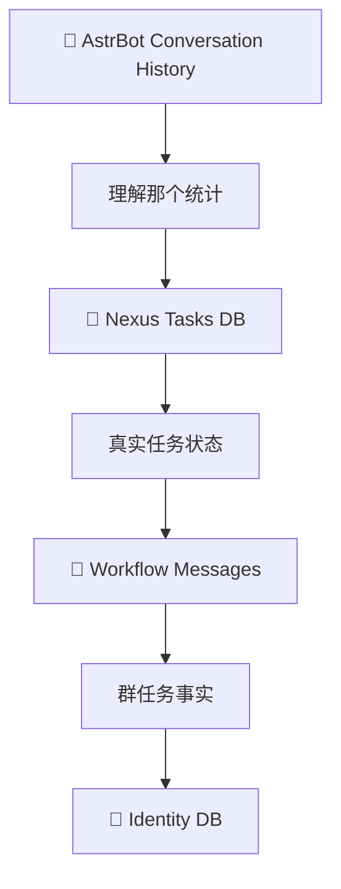

# 🌌 微光·群枢 / Lumielle Nexus

> 一个面向 AstrBot + QQ 的跨会话群事务编排插件。

[](metadata.yaml)
[](https://github.com/AstrBotDevs/AstrBot)
[](https://github.com/AstrBotDevs/AstrBot)
[](LICENSE)

微光·群枢（Lumielle Nexus）让私聊成为控制台，让群聊成为可调度的工作空间。它把提醒、DDL、信息收集、群消息事实、成员身份和安全操作持久化到同一个轻量 SQLite 任务系统中。

| 项目 | 当前版本 |
| --- | --- |
| Version | `0.6.0` |
| AstrBot | `>=4.28.0,<5` |
| Platform | `aiocqhttp` / OneBot v11（QQ，主要面向 NapCat） |
| License | MIT |

## 📊 当前状态

| 模块 | 状态 |
| --- | --- |
| Reminder / DDL / recurring / course | ✅ 已实现 |
| Collection | ✅ 已实现 |
| Checkpoint semantic workflow | ✅ 已实现 |
| Identity DB | ✅ 已实现 |
| Archive / Summary | ✅ 已实现 |
| Relay | ✅ 已实现 |
| Moderation | ✅ 已实现，默认关闭 |
| QQ 群管理员控制 | ✅ 当前绑定群内支持有限控制 |
| 自动测试 | ✅ 129 项 |
| Real-world QQ / NapCat / Provider validation | 🧪 仍需按实际部署验证 |

✅ 表示代码实现和自动化验证已完成；🧪 不代表已经在真实 QQ、NapCat 或付费 LLM Provider 环境中做过生产验证。

## ✨ 能做什么

### ⏰ 任务调度

- 单次 Reminder。
- DDL 及提前提醒。
- recurring reminder。
- course reminder。
- 插件重载后从 SQLite 恢复未完成任务。

### 📋 Collection 信息收集

- 按字段收集群成员信息，重复提交自动更新。
- 可按成员集合定向收集，并在创建时固定目标快照。
- 标准字段消息立即确定性写入；自然语言填写由持久化 workflow capture 和增量 checkpoint 统一处理。
- checkpoint 催办、deadline finalize、missing default 和 XLSX 导出。
- 成员身份字段可从标准提交和可信 checkpoint 结果学习，并支持 operator/当前群管理员核验。

### 🧠 群消息事实与 AI

- 群消息 Archive 默认关闭，开启后才记录新的文本消息。
- 按关键词、时间范围检索已保存的群文本。
- 按需群聊总结和自动 `weekly summary`（周总结）。
- 群消息不会逐条调用 LLM：平时先持久化 capture，checkpoint 只处理 cursor 之后的新消息。
- 总结模型只负责整理，不会自动创建 DDL 或其他任务。

### 🔐 协作与安全操作

- 跨群 Relay 使用 `prepare → preview → explicit confirm → send`。
- 成员集合按群隔离，可用于定向 Collection 和 Relay @成员集合。
- 单成员 mute、unmute、kick 默认关闭，使用独立 moderator 权限和确认预览。

## 🔄 Collection 工作流

```mermaid
flowchart LR
    A[创建统计任务] --> B[群消息持久化 Capture]
    B --> C[19:00 Checkpoint]
    C --> D[@ 未形成有效结果成员]
    D --> E[继续 Capture]
    E --> F[20:00 Finalize]
    F --> G[默认值]
    G --> H[XLSX]
```

典型流程是：平时只做持久化 capture，19:00 批量分析新增消息并催办，20:00 使用逻辑截止时间做最后一次 checkpoint、应用默认值并导出。checkpoint 只读取新增 cursor，不会重复分析整段历史。

## 🚀 30 秒上手

完成安装和配置后，先在私聊绑定目标群：

```text
/nexus bind 班群 123456789
/nexus groups
```

然后可以直接私聊自然语言：

```text
明天下午三点在班群提醒所有人交实验报告。
```

也可以使用命令 fallback：

```text
/nexus tasks
/nexus task R-...
/nexus cancel R-...
```

## 📋 真实 Collection 示例

管理员可以在私聊中，或在当前绑定群由 QQ 群主/管理员发起当前群控制：

```text
现在统计大家的返校情况，
19点提醒还没回复的同学，
20点截止，
没回复的默认未返校，
最后给我整理成表格。
```

成员可以提交：

```text
我7号下午三点回来
```

或者使用确定性字段格式：

```text
姓名：张三
返校时间：10月7日下午3点
```

两种消息都会先留下任务事实。标准字段格式会立即写入；自然语言不会在每条群消息到达时调用 LLM，而是在启用 `ai_extraction` 且到达 checkpoint、截止收尾或 operator 查询状态时批量理解。

### Checkpoint 时间和成本模型

```text
17:00 ─────────── 19:00 ─────────── 20:00
      💾 Capture       🧠 Checkpoint      🧠 Finalize
      0 LLM            only delta         📊 XLSX
```

例如 19:00 已分析到 cursor `#120`，20:00 只处理 `#121+`。私聊询问“目前统计怎么样？”会执行一次增量 checkpoint；如果没有新消息，则为 `0` 次 LLM 调用。checkpoint 受消息数、字符数和分片数限制，避免无限增长的上下文。

## 🪪 成员身份

Nexus 会把稳定身份字段保存在自己的身份表中：

```text
QQ 123456789
       ↓
姓名：张三
学号：2026123456
```

标准提交可以学习姓名/学号，checkpoint 只能产生未核验（unverified）身份；operator 或当前群 QQ 群主/管理员可以核验维护。已核验身份不会被普通 AI 结果覆盖，导出时会尽力将身份列放在统计结果前部。

## 🔄 跨会话同步



Conversation history 只用于辅助识别当前会话上下文，例如补充最近提到的任务引用；任务状态、群消息事实和身份数据的 source of truth 是插件自己的 SQLite。插件不会把 API key、token 或 Provider credential 写进数据库。

## 🔐 权限矩阵

| 能力 | 私聊 Operator/Admin | QQ 群 owner/admin | 普通群成员 |
| --- | :---: | :---: | :---: |
| 创建当前群 Collection | ✅ | ✅ | ❌ |
| 查看当前群统计 | ✅ | ✅ | ❌ |
| 当前群 Reminder / DDL | ✅ | ✅ | ❌ |
| Identity 维护 | ✅ | ✅ 当前群 | ❌ |
| 跨群 Relay | ✅ | ❌ | ❌ |
| Archive 管理 | ✅ | ❌ | ❌ |
| Bind Group | ✅ | ❌ | ❌ |
| Collection 回复 | — | — | ✅ |
| mute / unmute / kick | 独立 moderator 权限 | 不自动获得 | ❌ |

QQ群 admin 不等于 Nexus moderator。`operator_ids` 只控制普通群枢能力，不会自动升级为群管理权限；群管理还必须开启 `moderation_enabled`，并由 `moderator_ids` 或 AstrBot Admin 授权。跨群 Relay、Archive 和总结始终要求私聊 operator。

## 📦 安装

### 方法 A：AstrBot WebUI

AstrBot 当前支持从 WebUI 的插件页面安装：

```text
AstrBot WebUI → 插件 → 右下角 + → URL 安装
```

使用仓库地址：

```text
https://github.com/Lumielle-BlueOMOcean/astrbot_plugin_lumielle_nexus
```

安装后在插件页面找到“微光·群枢”，执行加载或重载。

### 方法 B：Git 安装到 `data/plugins`

```bash
cd AstrBot/data/plugins
git clone https://github.com/Lumielle-BlueOMOcean/astrbot_plugin_lumielle_nexus.git
cd astrbot_plugin_lumielle_nexus
git pull --ff-only origin main
```

然后执行：

```text
WebUI → 插件 → 微光·群枢 → 重载插件
```

升级时在已有插件目录执行 `git pull --ff-only origin main` 即可，不需要删除插件目录，也不应删除 plugin data。

### 依赖

在与 AstrBot 相同的 Python 环境中安装：

```bash
python -m pip install -r requirements.txt
```

本插件只额外依赖 `openpyxl`；AstrBot、aiocqhttp/OneBot 和 LLM Provider 由宿主环境提供。

## ⚙️ 初始配置

配置项以 `_conf_schema.json` 为准：

| 配置 | 默认值 | 说明 |
| --- | --- | --- |
| `operator_ids` | `[]` | 额外允许控制插件的 QQ 用户 ID；AstrBot Admin 始终允许 |
| `timezone` | `Asia/Shanghai` | 时间解析时区 |
| `scheduler_interval_seconds` | `15` | scheduler 检查间隔，运行时限制 `5–60` 秒 |
| `max_retry_count` | `3` | 普通提醒发送失败后的最大重试次数 |
| `collection_ack` | `true` | 是否确认确定性群成员提交 |
| `archive_max_message_chars` | `4000` | 单条归档文本上限，运行时限制 `256–20000` |
| `archive_retention_days` | `90` | 归档自动保留天数；`0` 表示不自动清理，其他值限制 `7–3650` |
| `moderation_enabled` | `false` | 是否开启单成员群管理；默认完全关闭 |
| `moderator_ids` | `[]` | 独立群管理 QQ 用户 ID，不继承 `operator_ids` |

## 🗃️ 数据、隐私与 Archive

运行数据写入 AstrBot plugin data directory，而不是插件仓库：

```text
data/plugin_data/astrbot_plugin_lumielle_nexus/
├── lumielle_nexus.db
└── exports/
```

SQLite 可能包含 task state、Collection 结果、workflow messages、成员身份和可选群消息归档。Collection workflow capture 是任务正常工作所需的数据；长期 Group Archive 则默认 opt-in：

```text
/nexus archive 班群 on
/nexus archive-status 班群
/nexus archive 班群 off
```

开启不会回溯旧消息，目前只保存 `GROUP_MESSAGE` 的可读文本表现，不下载图片、不做 OCR、不转写语音、不解析文件或视频。关闭只停止新增，不删除已有归档；明确清理请使用带确认的 `nexus_clear_archive`。

## 🛡️ 安全模型

### Relay

跨群发送永远不是一次自然语言请求就直接执行：

```text
prepare → preview → explicit confirm → send
```

`nexus_prepare_relay` 只生成 `X-...` preview；用户明确确认后才调用 `nexus_confirm_relay`。Relay 失败不自动重试，避免产生重复外部消息。

调度和确认流程按持久化、`at-least-once` 语义设计；跨群 Relay 仍坚持显式确认，并且失败后要求重新检查再 prepare。

### Moderation

群管理默认关闭，只支持单群单成员的 mute、unmute、kick。它需要独立 moderator 权限，且固定采用：

```text
prepare → preview → explicit confirm → execute
```

预览有效期 10 分钟；确认前会重新检查 Bot 和目标成员角色；不自动重试。进程在执行中断时会记录 outcome unknown，应先人工检查群状态。当前不支持批量管理、全员禁言、设置管理员或退群。

### LLM

群消息是 untrusted input。标准格式优先由确定性逻辑处理；checkpoint/summary 使用有界输入、明确的事实约束和确定性校验。Summary 不使用 tools，也不会自动创建任务。

## 🔧 Troubleshooting

### 插件加载失败

在 `WebUI → 插件` 查看具体错误，先确认 AstrBot 版本满足 `>=4.28.0,<5`、Python 依赖已安装，再尝试插件页面的一键重载。不要删除 plugin data 作为排错手段。

### 缺少 Python dependency

使用 AstrBot 实际运行的 Python 环境执行：

```bash
python -m pip install -r requirements.txt
```

### aiocqhttp unavailable

当前版本只正式支持 `aiocqhttp` / OneBot v11（QQ，主要面向 NapCat），没有声明其他平台适配。

### LLM checkpoint 不工作

检查：

- Collection 是否设置 `ai_extraction=true`；
- 创建任务的控制会话是否有可用 Provider；
- Provider 是否仍可用；
- checkpoint 时间是否已经到达，且 Collection 仍为 ACTIVE。

### Excel 没收到

导出失败不会回滚统计结果。先到 AstrBot plugin data directory 的 `exports/` 查找文件；QQ 文件回传可能因 OneBot/NapCat 权限或协议能力失败。

## 🚧 当前限制与后续规划

当前尚未实现：

- 同一群同时运行多个 ACTIVE Collection；
- 图片归档、OCR、语音转写、文件内容提取；
- embedding、向量数据库、RAG、知识图谱；
- WebUI 页面、Redis、ORM、新 Web 服务；
- 批量 moderation、全员禁言、设置管理员、退群；
- 根据群总结自动创建任务；
- 更复杂的课程表和周期规则。

真实 NapCat、QQ 群和 AstrBot Provider 环境仍建议在实际使用前做一次小范围验证，尤其是消息发送、文件回传和群管理权限。

## ✅ 开发验证

当前仓库已完成：

```bash
python3 -m compileall .
python3 -m unittest discover -s tests -v
git diff --check
```

结果为 129 项测试通过，AstrBot 4.28.0 官方源码 loader smoke 通过，31 个工具成功注册。当前没有进行真实 LLM 消耗测试，也没有在真实群执行 mute/kick 或发送测试 spam。

## ⚖️ License

MIT License — see [LICENSE](LICENSE).
